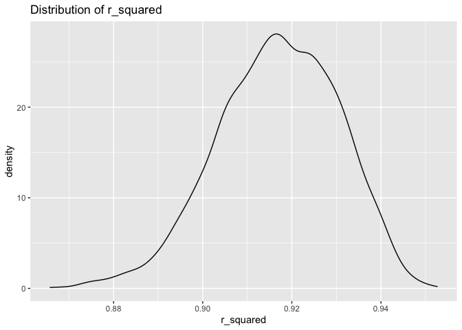
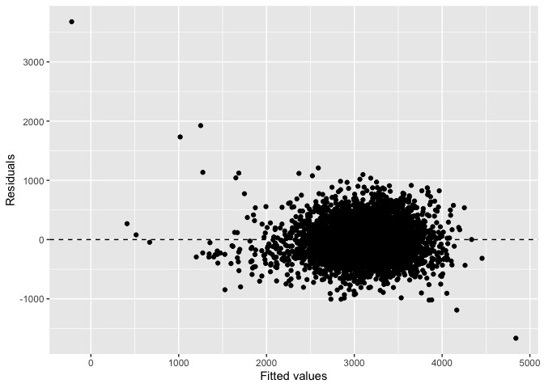
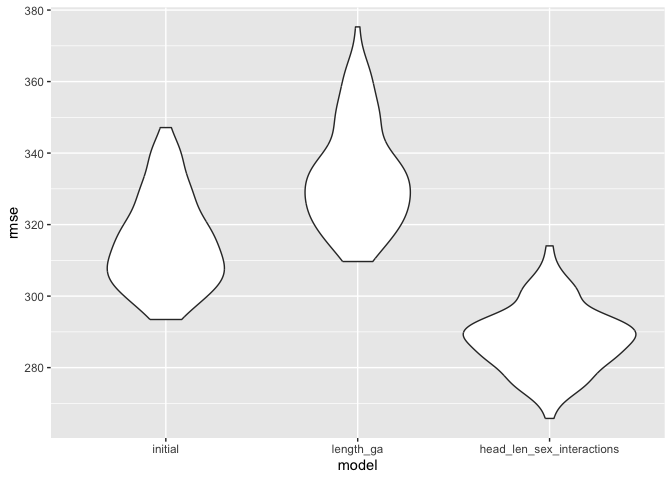

p8105_hw6_ys3765
================
Yixiao Sun
2023-11-27

``` r
library(tidyverse)
library(rnoaa)
library(broom)
library(rsample)
library(rsample)
library(yardstick)
library(tidymodels)
library(dplyr)
library(modelr)
```

# Problem 2

``` r
library(tidyverse)
weather_df = 
  rnoaa::meteo_pull_monitors(
    c("USW00094728"),
    var = c("PRCP", "TMIN", "TMAX"), 
    date_min = "2022-01-01",
    date_max = "2022-12-31") |>
  mutate(
    name = recode(id, USW00094728 = "CentralPark_NY"),
    tmin = tmin / 10,
    tmax = tmax / 10) |>
  select(name, id, everything())
```

    ## using cached file: /Users/elliot-sun/Library/Caches/org.R-project.R/R/rnoaa/noaa_ghcnd/USW00094728.dly

    ## date created (size, mb): 2023-11-27 17:58:25.425106 (8.544)

    ## file min/max dates: 1869-01-01 / 2023-11-30

``` r
library(rnoaa)
library(tidyverse)
library(broom)


set.seed(1)
n_bootstraps <- 5000
bootstrap_results <- tibble(r_squared = numeric(n_bootstraps), log_beta_product = numeric(n_bootstraps))

for (i in 1:n_bootstraps) {
  sample_data <- sample_n(weather_df, size = nrow(weather_df), replace = TRUE)
  model <- lm(tmax ~ tmin + prcp, data = sample_data)
  bootstrap_results$r_squared[i] <- glance(model)$r.squared
  beta_estimates <- coef(model)
  bootstrap_results$log_beta_product[i] <- log(beta_estimates[2] * beta_estimates[3])
  na.rm = TRUE
}
names(bootstrap_results) <- c("r_squared", "log_beta_product")
r_squared_values <- unlist(bootstrap_results$r_squared)

r_squared_distribution <- bootstrap_results%>%
  ggplot(aes(x = r_squared))+
  geom_density()+
  labs(x = "r_squared",title =  "Distribution of r_squared")

log_beta_distribution <- bootstrap_results%>%
  ggplot(aes(x = bootstrap_results$log_beta_product))+
  geom_density()+
  labs(x = "log_beta_product",title =  "Distribution of log_beta_product")
 
print(r_squared_distribution)
```

<!-- -->

``` r
print(log_beta_distribution)
```

<!-- -->

``` r
count_log_beta_product <- filter(bootstrap_results, is.nan(log_beta_product))%>%count()

proportion_log_beta_product <- count_log_beta_product/5000

print(proportion_log_beta_product)
```

    ##        n
    ## 1 0.6722

``` r
ci_r_squared <- quantile(bootstrap_results$r_squared, c(0.025, 0.975),na.rm = T) %>% knitr::kable()
ci_log_beta_product <- quantile(bootstrap_results$log_beta_product, c(0.025, 0.975), na.rm = T)%>%knitr::kable()

ci_r_squared
```

|       |         x |
|:------|----------:|
| 2.5%  | 0.8885495 |
| 97.5% | 0.9406812 |

``` r
ci_log_beta_product
```

|       |         x |
|:------|----------:|
| 2.5%  | -8.981559 |
| 97.5% | -4.601673 |

As we can see from the first density plot, the r squared values are
almost normally distributed. As we moved to the second plot, the
distribution becomes left skewed. As we moved to the log transformation,
a lot of null values produced. Approximately values are left to be
valid. For the r squared value, the 95 percent confidence interval is
between

|       |         x |
|:------|----------:|
| 2.5%  | 0.8885495 |
| 97.5% | 0.9406812 |

. And for the log beta prodects value, the 95 percent confidence
interval is between

|       |         x |
|:------|----------:|
| 2.5%  | -8.981559 |
| 97.5% | -4.601673 |

.

# Problem 3

``` r
bw<-read_csv('~/Desktop/P8105_ Data Science/p8105_hw6_ys3765/birthweight.csv')%>%na.omit()
```

    ## Rows: 4342 Columns: 20
    ## ── Column specification ────────────────────────────────────────────────────────
    ## Delimiter: ","
    ## dbl (20): babysex, bhead, blength, bwt, delwt, fincome, frace, gaweeks, malf...
    ## 
    ## ℹ Use `spec()` to retrieve the full column specification for this data.
    ## ℹ Specify the column types or set `show_col_types = FALSE` to quiet this message.

``` r
bw<-read_csv('~/Desktop/P8105_ Data Science/p8105_hw6_ys3765/birthweight.csv')%>%na.omit()
```

    ## Rows: 4342 Columns: 20
    ## ── Column specification ────────────────────────────────────────────────────────
    ## Delimiter: ","
    ## dbl (20): babysex, bhead, blength, bwt, delwt, fincome, frace, gaweeks, malf...
    ## 
    ## ℹ Use `spec()` to retrieve the full column specification for this data.
    ## ℹ Specify the column types or set `show_col_types = FALSE` to quiet this message.

``` r
summary(bw)
```

    ##     babysex          bhead          blength           bwt           delwt      
    ##  Min.   :1.000   Min.   :21.00   Min.   :20.00   Min.   : 595   Min.   : 86.0  
    ##  1st Qu.:1.000   1st Qu.:33.00   1st Qu.:48.00   1st Qu.:2807   1st Qu.:131.0  
    ##  Median :1.000   Median :34.00   Median :50.00   Median :3132   Median :143.0  
    ##  Mean   :1.486   Mean   :33.65   Mean   :49.75   Mean   :3114   Mean   :145.6  
    ##  3rd Qu.:2.000   3rd Qu.:35.00   3rd Qu.:51.00   3rd Qu.:3459   3rd Qu.:157.0  
    ##  Max.   :2.000   Max.   :41.00   Max.   :63.00   Max.   :4791   Max.   :334.0  
    ##     fincome          frace          gaweeks         malform        
    ##  Min.   : 0.00   Min.   :1.000   Min.   :17.70   Min.   :0.000000  
    ##  1st Qu.:25.00   1st Qu.:1.000   1st Qu.:38.30   1st Qu.:0.000000  
    ##  Median :35.00   Median :2.000   Median :39.90   Median :0.000000  
    ##  Mean   :44.11   Mean   :1.655   Mean   :39.43   Mean   :0.003455  
    ##  3rd Qu.:65.00   3rd Qu.:2.000   3rd Qu.:41.10   3rd Qu.:0.000000  
    ##  Max.   :96.00   Max.   :8.000   Max.   :51.30   Max.   :1.000000  
    ##     menarche        mheight          momage         mrace      
    ##  Min.   : 0.00   Min.   :48.00   Min.   :12.0   Min.   :1.000  
    ##  1st Qu.:12.00   1st Qu.:62.00   1st Qu.:18.0   1st Qu.:1.000  
    ##  Median :12.00   Median :63.00   Median :20.0   Median :2.000  
    ##  Mean   :12.51   Mean   :63.49   Mean   :20.3   Mean   :1.627  
    ##  3rd Qu.:13.00   3rd Qu.:65.00   3rd Qu.:22.0   3rd Qu.:2.000  
    ##  Max.   :19.00   Max.   :77.00   Max.   :44.0   Max.   :4.000  
    ##      parity            pnumlbw     pnumsga      ppbmi            ppwt      
    ##  Min.   :0.000000   Min.   :0   Min.   :0   Min.   :13.07   Min.   : 70.0  
    ##  1st Qu.:0.000000   1st Qu.:0   1st Qu.:0   1st Qu.:19.53   1st Qu.:110.0  
    ##  Median :0.000000   Median :0   Median :0   Median :21.03   Median :120.0  
    ##  Mean   :0.002303   Mean   :0   Mean   :0   Mean   :21.57   Mean   :123.5  
    ##  3rd Qu.:0.000000   3rd Qu.:0   3rd Qu.:0   3rd Qu.:22.91   3rd Qu.:134.0  
    ##  Max.   :6.000000   Max.   :0   Max.   :0   Max.   :46.10   Max.   :287.0  
    ##      smoken           wtgain      
    ##  Min.   : 0.000   Min.   :-46.00  
    ##  1st Qu.: 0.000   1st Qu.: 15.00  
    ##  Median : 0.000   Median : 22.00  
    ##  Mean   : 4.145   Mean   : 22.08  
    ##  3rd Qu.: 5.000   3rd Qu.: 28.00  
    ##  Max.   :60.000   Max.   : 89.00

``` r
categorical_vars <- c("babysex", "frace", "malform", "mrace")
bw[categorical_vars] <- lapply(bw[categorical_vars], factor)

initial_model <- lm(bwt ~babysex + blength + delwt + gaweeks + mheight + mrace + ppwt +smoken, data = bw)
summary(initial_model)
```

    ## 
    ## Call:
    ## lm(formula = bwt ~ babysex + blength + delwt + gaweeks + mheight + 
    ##     mrace + ppwt + smoken, data = bw)
    ## 
    ## Residuals:
    ##     Min      1Q  Median      3Q     Max 
    ## -1665.1  -208.7    -5.3   202.1  3677.7 
    ## 
    ## Coefficients:
    ##               Estimate Std. Error t value Pr(>|t|)    
    ## (Intercept) -4200.3363   148.1879 -28.345  < 2e-16 ***
    ## babysex2      -20.6095     9.6534  -2.135 0.032821 *  
    ## blength       115.0705     1.9846  57.981  < 2e-16 ***
    ## delwt           5.3097     0.4514  11.762  < 2e-16 ***
    ## gaweeks        22.8241     1.6481  13.849  < 2e-16 ***
    ## mheight         6.8940     2.0565   3.352 0.000808 ***
    ## mrace2       -183.3331    10.6002 -17.295  < 2e-16 ***
    ## mrace3        -72.9632    48.8778  -1.493 0.135571    
    ## mrace4        -82.6732    22.0706  -3.746 0.000182 ***
    ## ppwt           -3.2243     0.4934  -6.535  7.1e-11 ***
    ## smoken         -6.3850     0.6751  -9.457  < 2e-16 ***
    ## ---
    ## Signif. codes:  0 '***' 0.001 '**' 0.01 '*' 0.05 '.' 0.1 ' ' 1
    ## 
    ## Residual standard error: 314.8 on 4331 degrees of freedom
    ## Multiple R-squared:  0.623,  Adjusted R-squared:  0.6221 
    ## F-statistic: 715.7 on 10 and 4331 DF,  p-value: < 2.2e-16

``` r
birth_data <- bw %>% 
  add_predictions(initial_model) %>% 
  add_residuals(initial_model)

ggplot(birth_data, aes(x = pred, y = resid)) +
  geom_point() +
  geom_hline(yintercept = 0, linetype = "dashed") +
  labs(x = "Fitted values", y = "Residuals")
```

<!-- -->

``` r
model_length_ga <- lm(bwt ~ blength + gaweeks, data = bw)
model_head_len_sex_interactions <- lm(bwt ~ bhead * blength * babysex, data = bw)
```

My proposed model is to use birthweight to model with “babysex +
blength + delwt + gaweeks + mheight + mrace + ppwt +smoken” all these
variables as our basic model for the later use to compare with the later
two others. Then we add prediction and add residuals into the model,
here is the plot for the fitted values and residuals.

``` r
birth_data |> 
  gather_predictions(initial_model, model_length_ga, model_head_len_sex_interactions) |> 
  mutate(model = fct_inorder(model))
```

    ## # A tibble: 13,026 × 23
    ##    model         babysex bhead blength   bwt delwt fincome frace gaweeks malform
    ##    <fct>         <fct>   <dbl>   <dbl> <dbl> <dbl>   <dbl> <fct>   <dbl> <fct>  
    ##  1 initial_model 2          34      51  3629   177      35 1        39.9 0      
    ##  2 initial_model 1          34      48  3062   156      65 2        25.9 0      
    ##  3 initial_model 2          36      50  3345   148      85 1        39.9 0      
    ##  4 initial_model 1          34      52  3062   157      55 1        40   0      
    ##  5 initial_model 2          34      52  3374   156       5 1        41.6 0      
    ##  6 initial_model 1          33      52  3374   129      55 1        40.7 0      
    ##  7 initial_model 2          33      46  2523   126      96 2        40.3 0      
    ##  8 initial_model 2          33      49  2778   140       5 1        37.4 0      
    ##  9 initial_model 1          36      52  3515   146      85 1        40.3 0      
    ## 10 initial_model 1          33      50  3459   169      75 2        40.7 0      
    ## # ℹ 13,016 more rows
    ## # ℹ 13 more variables: menarche <dbl>, mheight <dbl>, momage <dbl>,
    ## #   mrace <fct>, parity <dbl>, pnumlbw <dbl>, pnumsga <dbl>, ppbmi <dbl>,
    ## #   ppwt <dbl>, smoken <dbl>, wtgain <dbl>, pred <dbl>, resid <dbl>

``` r
cv_df =
  crossv_mc(birth_data, 100) |> 
  mutate(
    train = map(train, as_tibble),
    test = map(test, as_tibble))

cv_df = 
  cv_df |> 
  mutate(
    initial_model  = map(train, \(df) lm(bwt ~ babysex + blength + delwt + gaweeks + mheight + mrace + ppwt +smoken, data = birth_data)),
    model_length_ga     = map(train, \(df) lm(bwt ~ blength + gaweeks, data = birth_data)),
    model_head_len_sex_interactions  = map(train, \(df)  lm(bwt ~ bhead * blength * babysex, data = birth_data))) |> 
  mutate(
    rmse_initial = map2_dbl(initial_model, test, \(mod, df) rmse(model = mod, data = df)),
    rmse_length_ga  = map2_dbl(model_length_ga, test, \(mod, df) rmse(model = mod, data = df)),
    rmse_head_len_sex_interactions = map2_dbl(model_head_len_sex_interactions, test, \(mod, df) rmse(model = mod, data = df)))

print(cv_df)
```

    ## # A tibble: 100 × 9
    ##    train    test     .id   initial_model model_length_ga model_head_len_sex_in…¹
    ##    <list>   <list>   <chr> <list>        <list>          <list>                 
    ##  1 <tibble> <tibble> 001   <lm>          <lm>            <lm>                   
    ##  2 <tibble> <tibble> 002   <lm>          <lm>            <lm>                   
    ##  3 <tibble> <tibble> 003   <lm>          <lm>            <lm>                   
    ##  4 <tibble> <tibble> 004   <lm>          <lm>            <lm>                   
    ##  5 <tibble> <tibble> 005   <lm>          <lm>            <lm>                   
    ##  6 <tibble> <tibble> 006   <lm>          <lm>            <lm>                   
    ##  7 <tibble> <tibble> 007   <lm>          <lm>            <lm>                   
    ##  8 <tibble> <tibble> 008   <lm>          <lm>            <lm>                   
    ##  9 <tibble> <tibble> 009   <lm>          <lm>            <lm>                   
    ## 10 <tibble> <tibble> 010   <lm>          <lm>            <lm>                   
    ## # ℹ 90 more rows
    ## # ℹ abbreviated name: ¹​model_head_len_sex_interactions
    ## # ℹ 3 more variables: rmse_initial <dbl>, rmse_length_ga <dbl>,
    ## #   rmse_head_len_sex_interactions <dbl>

``` r
cv_df |> 
  select(starts_with("rmse")) |> 
  pivot_longer(
    everything(),
    names_to = "model", 
    values_to = "rmse",
    names_prefix = "rmse_") |> 
  mutate(model = fct_inorder(model)) |> 
  ggplot(aes(x = model, y = rmse)) + geom_violin()
```

<!-- -->
